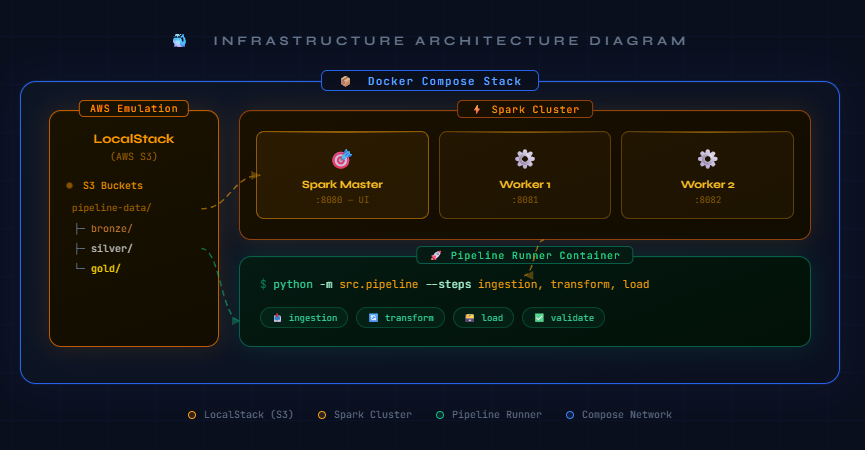

# 🚀 Spark × LocalStack — End-to-End Data Pipeline

[](https://www.python.org/)
[](https://spark.apache.org/)
[](https://localstack.cloud/)
[](LICENSE)

> A production-grade, **fully runnable** data engineering project demonstrating a **Medallion Architecture** (Bronze → Silver → Gold) with **PySpark** and **AWS S3** (emulated via **LocalStack**), all orchestrated through **Docker Compose** and validated by a **GitHub Actions CI/CD** pipeline.

---

## 📐 Architecture

## Architecture

[](architecture.png)

Diagrama interativo (HTML): [Abrir](docs/architecture.html)

### Medallion Layers

| Layer      | Format  | Contents                                      | Partitioning              |
|------------|---------|-----------------------------------------------|---------------------------|
| **Bronze** | Parquet | Raw validated CSV + ingestion metadata        | `order_year / order_month` |
| **Silver** | Parquet | Deduplicated, cleaned, enriched with RFM cols | `year / month / category`  |
| **Gold**   | Parquet | 3 aggregated data marts (analytics-ready)     | none (small datasets)      |

### Gold Data Marts

| Mart                   | Description                                    |
|------------------------|------------------------------------------------|
| `sales_by_region`      | Monthly revenue KPIs per region with rankings  |
| `product_performance`  | Top products per category with RFM context     |
| `customer_segments`    | RFM-based customer segmentation (5 tiers)      |

---

## ⚡ Quick Start (One Command Demo)

```bash
# 1. Clone
git clone https://github.com/YOUR_USERNAME/spark-localstack-pipeline.git
cd spark-localstack-pipeline

# 2. Copy env file (defaults work out-of-the-box)
cp .env.example .env

# 3. Full demo: start stack + generate data + run pipeline
make demo
```

That's it! Open **http://localhost:8080** to see the Spark UI.

---

## 🔧 Prerequisites

| Tool         | Version  | Install                            |
|--------------|----------|------------------------------------|
| Docker       | ≥ 24     | https://docs.docker.com/get-docker |
| Docker Compose | ≥ 2.20 | included with Docker Desktop       |
| Python       | ≥ 3.11   | https://python.org                 |
| GNU Make     | any      | `brew install make` / apt          |
| AWS CLI      | ≥ 2      | (optional) for inspecting S3       |

---

## 📋 All Make Commands

```bash
make help           # Show all commands

# Infrastructure
make up             # Start LocalStack + Spark cluster
make down           # Stop everything
make build          # Rebuild Docker images from scratch
make logs           # Follow all container logs
make shell          # Open bash inside pipeline-runner
make status         # Show containers + S3 buckets

# Data Generation
make data           # Generate 50k synthetic orders → S3 bronze
make data-small     # Generate 5k orders (faster for testing)

# Pipeline
make pipeline           # Full pipeline: ingestion + transform + load
make pipeline-ingestion # Step 1 only: CSV → Bronze Parquet
make pipeline-transform # Step 2 only: Bronze → Silver Parquet
make pipeline-load      # Step 3 only: Silver → Gold marts

# Testing
make install-dev    # Install dev dependencies locally
make test           # Run unit tests
make test-cov       # Run tests with HTML coverage report

# Code Quality
make lint           # Ruff linter
make format         # Black + Ruff auto-format

# Cleanup
make clean          # Remove caches, generated files
make demo           # 🎬 One-shot: up + data-small + pipeline
```

---

## 🧪 Testing

Tests run **without Docker** using a local SparkSession and `moto` to mock S3:

```bash
# Install dependencies
make install-dev

# Run tests
make test

# With coverage
make test-cov
# → open htmlcov/index.html
```

### Test structure

```
tests/
├── conftest.py           # SparkSession fixture + sample DataFrame
├── test_ingestion.py     # Schema validation, metadata enrichment
├── test_transformation.py # Deduplication, cleaning, Silver columns
└── test_load.py          # Gold mart aggregations, RFM segmentation
```

---

## 🏗️ Project Structure

```
spark-localstack-pipeline/
├── .github/
│   └── workflows/
│       └── ci.yml              # GitHub Actions: lint → test → docker → e2e
├── docker/
│   └── spark/
│       ├── Dockerfile          # Bitnami Spark + Hadoop AWS + PySpark deps
│       └── spark-defaults.conf # S3A / LocalStack tuning
├── src/
│   ├── jobs/
│   │   ├── ingestion.py        # Bronze layer: CSV → Parquet
│   │   ├── transformation.py   # Silver layer: clean + dedupe + enrich
│   │   └── load.py             # Gold layer: 3 aggregated marts
│   ├── utils/
│   │   ├── spark_session.py    # SparkSession factory (S3A pre-configured)
│   │   └── aws_helpers.py      # S3 client, bucket helpers
│   └── pipeline.py             # Orchestrator (CLI entry point)
├── tests/
│   ├── conftest.py
│   ├── test_ingestion.py
│   ├── test_transformation.py
│   └── test_load.py
├── scripts/
│   ├── init_localstack.sh      # Auto-creates S3 buckets on stack start
│   └── generate_data.py        # Faker-based synthetic data generator
├── data/sample/                # Local CSV landing zone (gitignored)
├── docker-compose.yml
├── Makefile
├── pyproject.toml              # Ruff + Black + Pytest config
├── requirements.txt
├── requirements-dev.txt
└── .env.example
```

---

## 🔄 CI/CD Pipeline

```
Push / PR
    │
    ▼
┌─────────┐    ┌────────────┐    ┌──────────────┐    ┌──────────┐
│  Lint   │───►│ Unit Tests │───►│ Docker Build │───►│   E2E    │
│ (ruff + │    │  (pytest + │    │ (Spark image)│    │(LocalStack│
│  black) │    │   moto)    │    │              │    │  + Spark) │
└─────────┘    └────────────┘    └──────────────┘    └──────────┘
                                                            │
                                               (on main branch only)
                                                            │
                                                     ┌──────▼──────┐
                                                     │   Publish   │
                                                     │  (on tag v*)│
                                                     └─────────────┘
```

- **Unit tests** run on every push/PR (no Docker required — uses moto)
- **E2E tests** run on merges to `main` (full LocalStack + Spark stack)
- **Docker publish** triggers on `git tag v*`

---

## 📊 Inspecting Results with AWS CLI

```bash
# List S3 contents
aws --endpoint-url=http://localhost:4566 s3 ls s3://pipeline-data/ --recursive

# Count Parquet files per layer
aws --endpoint-url=http://localhost:4566 s3 ls s3://pipeline-data/gold/ --recursive | wc -l

# Download a Gold mart locally
aws --endpoint-url=http://localhost:4566 s3 cp \
  s3://pipeline-data/gold/sales_by_region/ ./local_gold/ --recursive
```

---

## 🤝 Contributing

1. Fork the repo
2. Create a feature branch: `git checkout -b feat/my-feature`
3. Make your changes + add tests
4. Run `make lint test` before committing
5. Open a Pull Request

---

## 📄 License

MIT — see [LICENSE](LICENSE).
